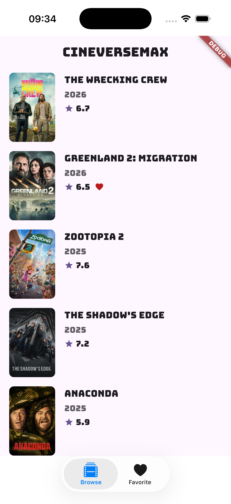
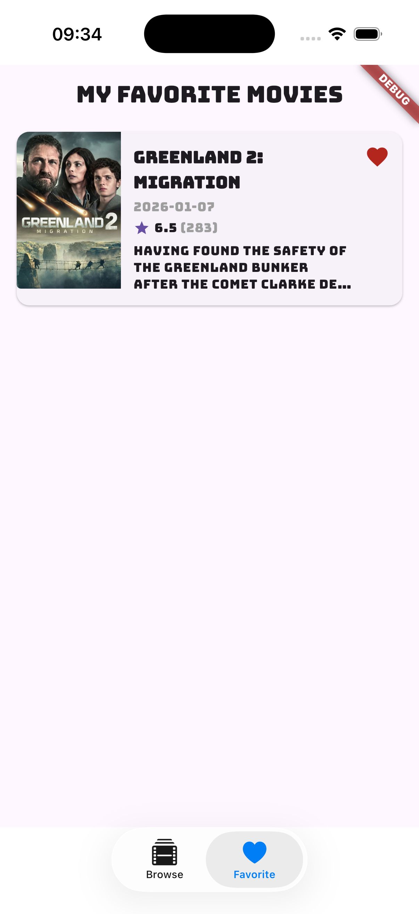
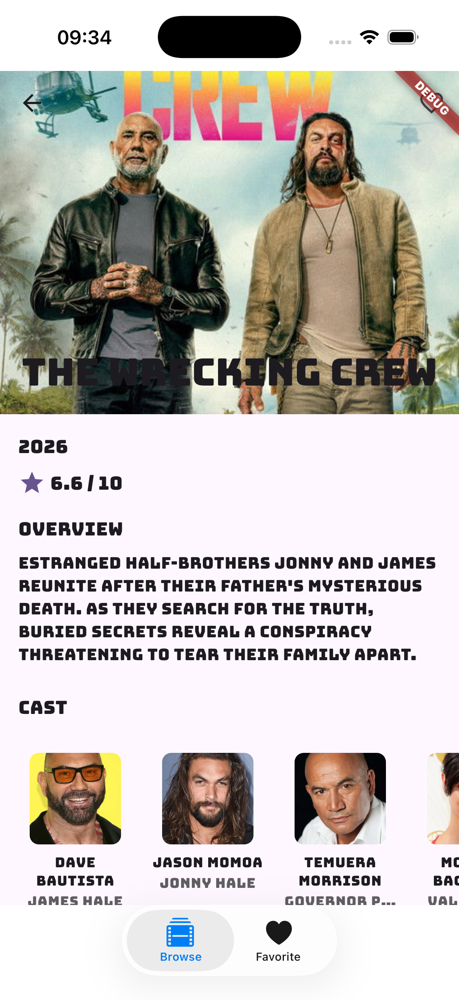
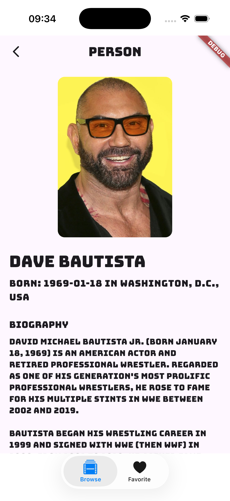

# MovieiOS

iOS Super App that serves as a container for rendering Flutter modules and facilitating inter-module communication via method and event channels.

## Screenshots

| 1 | 2 | 3 | 4 |
|---|---|---|---|
|  |  |  |  |

## Overview

This is a **super app architecture** where:
- **No business logic**: The app contains only UI logic for switching between Flutter engines
- **Flutter module container**: Renders every Flutter module in the app
- **Inter-module communication**: Enables Flutter modules to communicate with each other via method channels and event channels
- **Multi-client support**: All branding and configuration parameters are injectable via Jenkins for scaling to multiple clients/co-brands

## Architecture

- **Main screen**: Bottom tab bar with Browse and Favorite tabs. Each tab hosts a full-screen Flutter view.
- **Extra screen**: Movie detail launched when tapping a movie from the Favorite list. Uses a dynamically created Flutter engine.
- **Flutter engines**: `browse_engine` and `favorite_engine` are cached at launch. Extra engines are created per movie navigation and disposed when the screen is dismissed.
- **Channel communication**: Method channels (`com.movie.android/channel`) and event channels (`com.movie.android/events`) enable communication between Flutter modules and native iOS code.

## Prerequisites

- Xcode 26+
- Flutter SDK (for building the Flutter module)
- CocoaPods (optional; this project uses pre-built XCFrameworks)

## Importing Flutter XCFrameworks

This project expects pre-built Flutter XCFrameworks from the `movie_core` module. **Build the frameworks before opening the iOS project.**

### 1. Build the Flutter module

From the `movie_core` directory:

```bash
cd /path/to/fastwork/movie_core
flutter pub get
flutter build ios-framework --output=../MovieiOS/Flutter
```

This creates:

```
MovieiOS/Flutter/
├── Debug/
│   ├── Flutter.xcframework
│   └── App.xcframework
├── Profile/
│   ├── Flutter.xcframework
│   └── App.xcframework
└── Release/
    ├── Flutter.xcframework
    └── App.xcframework
```

### 2. Xcode configuration

The project is already configured to use `$(PROJECT_DIR)/Flutter/$(CONFIGURATION)/` for framework search paths. Build configurations (Debug, Release, Profile) automatically select the matching frameworks.

**Important**: Always use `Flutter.xcframework` and `App.xcframework` from the **same** build mode. Mixing Debug/Release causes runtime crashes.

## Multi-Client Branding & Configuration

All branding and configuration parameters are injected at build time via Jenkins through `ci/ci_brand.xcconfig`. This enables the same codebase to support multiple clients/co-brands without code changes.

**Realistic mocking**: Full branding details, assets (logos, fonts, splash screens), and configuration (bundle IDs, API endpoints, colors, etc.) can be found in the [brand repository](https://github.com/stableprinter/brand). It contains `staging.json`, `production.json`, and environment-specific assets under `asset/` for multi-client builds. You can override `ci/ci_brand.xcconfig` with values from the brand repo for local development and realistic mocking.

### Branding Parameters (injectable via Jenkins)

- `APP_DISPLAY_NAME` - App display name
- `PRODUCT_BUNDLE_IDENTIFIER` - Bundle identifier
- `BASE_URL` - API base URL
- `IMAGE_BASE_URL` - Image CDN base URL
- `WEBSOCKET_URL` - WebSocket connection URL
- `DEEP_LINK_SCHEME` - Deep link URL scheme
- `SUPPORT_EMAIL` - Support email address
- Custom fonts (`brand.ttf`) - Copied by Jenkins build process

These values are automatically injected into `Info.plist` and passed to Flutter engines as initialization arguments, ensuring each client build has the correct branding and configuration.

## Channel Communication

- **Method channel**: `com.movie.android/channel` - Bidirectional communication between Flutter modules and native iOS
- **Event channel**: `com.movie.android/events` - Native-to-Flutter event streaming for inter-module communication

Channel names must match Android implementation for cross-platform consistency.

## Run

1. Build Flutter frameworks (see above)
2. Open `MovieiOS.xcodeproj` in Xcode
3. Select a simulator or device
4. Build and run (⌘R)
